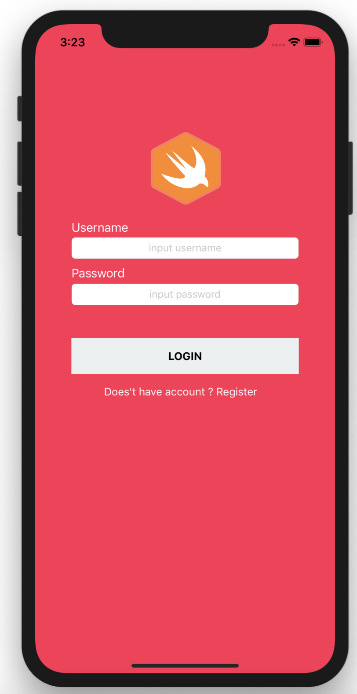
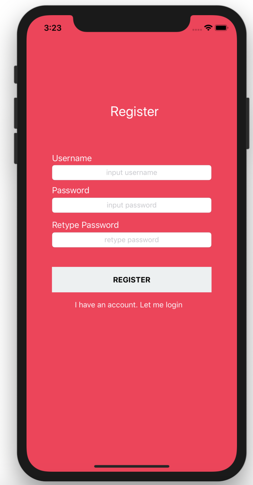
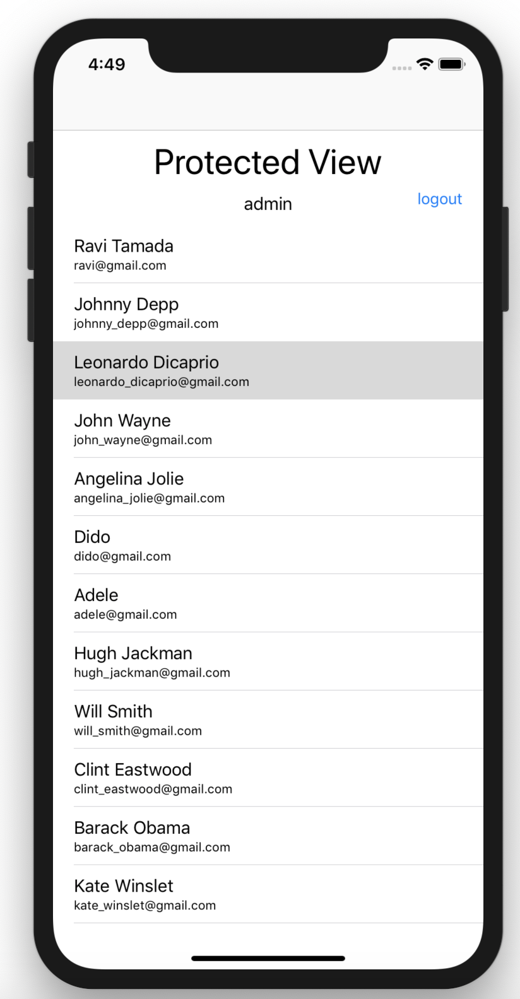

# IOS SWIFT MiniPorject
This is my first iOS project made with Swift and Xcode, I'm currently trying to learn iOS programming. This is not a `Hello World` project, I try to make common functions that are often used in building an application such as Calling API, Passing data between page, Internal data store and others.

#### Features
* Login page
* Register page
* Session / Internal data store (NSUserDefault)
* API Services (Alamofire)
* Switching between UIViewController
* Passing data between UIViewController
* Navigation Controller
* Listview with UITableView
* Constraint Layouting

</img>
</img>
</img>

#### Libs
* [Alamofire](https://github.com/Alamofire/Alamofire)
* [SwiftyJSON](https://github.com/SwiftyJSON/SwiftyJSON)

